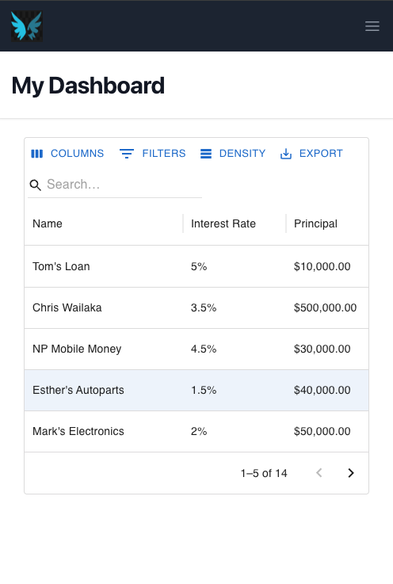

# Collins Munene - FSE Numida Test

## Overview

### Tasks Completed
- [x] **Using Re-usable components**  
  Refactored and modularized the code by creating reusable components across both frontend and backend.

- [x] **Refactor of data relationships & endpoints**  
  Optimized and reorganized the data relationships and endpoints to improve efficiency and maintainability.

- [x] **Rework on code structure**  
  Improved the organization of the codebase for better readability and scalability.

- [x] **Update of core dependencies**  
  Updated all core dependencies to their latest stable versions to ensure compatibility and security.

- [x] **Exposing of necessary GraphQL queries & mutations**  
  Defined and exposed necessary GraphQL queries and mutations to interact with the backend.

- [x] **Display & Styling of Loan and Loan Payments from the server**  
  Designed and styled the frontend to display loan and payment data fetched from the server.

- [x] **Solving of problem statement**  
  Addressed the primary problem statement and delivered a solution that meets the required functionality.

- [x] **Refactoring the Loan Calculator**  
  Refactored and optimized the Loan Calculator functionality.

- [x] **Addition of Loan Payment Creation REST API**  
  Added a new API endpoint to allow the creation of loan payments via REST.

- [x] **Refactor of User Interface & Experience**  
  Improved the user interface and enhanced the user experience to ensure ease of use.

- [x] **Error handling on the API's**  
  Implemented robust error handling to ensure the APIs respond gracefully to various failure scenarios.

- [x] **Unit tests**  
  Added unit tests to ensure code reliability and detect bugs early.

- [x] **Creation of GitHub Repository**  
  Created and set up a GitHub repository to host and manage the project.

- [x] **Documentation of approach & code**  
  Documented the approach taken during development and explained the code to make it easy to understand.


---

## Backend Development Approach

### Technologies Used
- **Backend Framework**: The server-side of the application is built using Python's Flask framework.
- **Database**: For this project, I opted not to use databases like Postgres or SQLite. Instead, I used file storage as the database, storing data in a simple JSON file. This approach was chosen to keep things quick and simple for the scope of this project.
- **API Design**: The application uses a combination of GraphQL and REST APIs.
- **Testing**: I utilized Pytest,unittest.mock for generating mock data and running unit tests. Flask's built-in testing utilities were also used to test the server routes and API responses.


### Development Approach Overview
- **Initial Backend Analysis & Dependency Management**

To begin with, I looked into the backend since it's the main source of data. After taking a close look at the existing dependencies, I found a few that were outdated. To address this, I set up a new virtual environment, installed the dependencies, and then updated them to the latest stable versions.
However, I hit a roadblock when I discovered that the latest version of flask-graphql (2.0.1) didn't support the newer version of graphql-core (3.2.5). This incompatibility led me to shift gears and explore an alternative: Ariadne, a Python library designed for building GraphQL APIs. Ariadne supports SDL (Schema Definition Language) syntax, which allowed me to define the schema first and the resolvers later. This was a more structured and efficient approach, especially since it resembled the way I’d work with Graphene in a Django project.

- **GraphQL Setup & Analysis**

Once I had the Ariadne setup in place and the GraphQL playground up and running, I tested the existing GraphQL queries. I reviewed their outputs and examined the available Loan and Loan Payments data. With this analysis, I was ready to move forward and start designing the new endpoints (both GraphQL and REST API). At this point, I commited this project to my GitHub repository for tracking changes and storing the progress.

- **Local Development Setup**

For speed and efficiency, I decided to run the server locally without Docker to streamline the debugging process. This made it easier to iterate quickly. The next challenge was deciding on how to store the Loan and Payments data for manipulation and persistence. Since it was a small, quick project, I opted for file system storage, essentially saving the data in a JSON file. Once the storage solution was in place, I created the necessary data structures, including custom scalars (since GraphQL doesn’t have a native "Date" scalar), as well as the queries and mutations.

- **Enhancing GraphQL Queries & Mutations**

For the GraphQL queries, I added input filters so that the frontend could customize the data it receives based on specific needs (like filtering loans or payments). This made the queries more flexible. For the Loan queries I opted to add a boolean 'isCombined' filter that would allow returning combined data(loan & payments) as output and at the same time return the whole loan object if set to false. On the mutation side, I implemented additional functionality to manage Loans, such as update and delete mutations. This would allow Admins to modify loan details like the due date and status, offering more control over the data. The APIs also take care of errors & exceptions plus most edge use cases.

- **Utility Functions for Data Management**

To further improve the application, I created utility functions like calculate_payment_status. This function helped determine whether a payment was made on time or late, based on the due date of the loan. Additionally, I implemented read_data and write_data functions to handle interactions with the JSON file, enabling data retrieval and updates.

- **Testing**

For testing, I opted for Unit Tests using pytest and unittest for generating mock data. I focused on testing the main endpoints, specifically, the functionality for pulling loan data and creating/listing loan payments. This ensured that the core features were working as expected.

---

## Frontend Development Approach

### Technologies Used
- **Frontend Framework**: The frontend of the application is built using Vite Framework
- **Styling**: Styling has been based on Tailwind CSS and MUI components

### Development Approach Overview
- **Initial Setup & Dependency Updates**

I started by analyzing the existing frontend structure, reviewing the entry files, Installing Dependencies and comparing the code structure with the Running UI. After that, I updated the project dependencies to their latest versions, just like I did with the backend. Everything went smoothly on this front. To enhance the design, I installed Tailwind CSS and Material-UI (MUI) to take advantage of their pre-built CSS styles.

- **UI Layout & Design Inspiration**  

I then searched for design inspirations on Tailwind that would serve as the base for the default dashboard view. Once I settled on a design, I began creating the default Dashboard Layout component which is largely borrowed from tailwind. This layout would serve as the foundational structure, ensuring that all other components could be placed within it as child components. After finalizing the layout structure and modifying the content within it, I proceeded to create the following components:

Loan Datatable: For listing combined loan information fetched from the backend.

Loan Payments: For displaying payment details related to each loan.

- **Component Development & Integration**

With the basic layout and components in place, I integrated data from the backend via GraphQL. The Loan Datatable component fetches the loan information, passing an isCombined flag to consolidate the data, while the Loan Payments component shows payments associated with each loan.

I added a Make Payment button to allow users to submit new payments to the REST API. Additionally, I updated the Loan Payment component to show the total amount paid so far by the user and display the remaining interest if the loan due date has not yet passed. To achieve this, I used the getMonthsUntilDue utility and the LoanCalculator component, fixing the component error by properly defining the component's props.

- **Enhancing the Loan Table**

The Loan Datatable component was enhanced with filters to allow users to easily sort or filter through the list of loans. I also implemented loaders to provide visual feedback while the data is being fetched and error handlers to manage any issues during data retrieval.

- **Environment Variables & Logo changes**

To simplify management, I added the common base URL to the environment configuration file. I also made an attempt to modify the logo to fit the overall UI, although the transparent background issue still needs to be addressed.

- **Custom Render Functions**

For rendering the content in the Loan Datatable, I used a custom render function to display different color statuses based on the loan's condition. This was in line with the requested design. Additionally, I incorporated toasts to provide feedback when new payments are created, improving user interaction and experience.

---

## Additional Suggestions

Based on the current application process, I would suggest the following

- Integration with PostgreSQL as the primary database for data storage.

- User Authentication to securely manage user access and roles.

- Enabling Admin Control to approve or reject loans and modify loan terms as necessary.

- Loan Creation from the UI, allowing users to add new loans directly through the application interface.

- Payment Platform Integration to enable loan repayments directly from within the application.

- Prevention of Loan Overpayment by adding additional columns to the Loan table to track payments and avoid exceeding the loan amount.

- Due Date Alerts & Notifications to keep users informed about upcoming payment deadlines.

---

## Links

- [GitHub Repository](https://github.com/CollinsMunene/Numida-FSE-test.git)
- [Session Recording](https://drive.google.com/drive/folders/1nQLDwTX7H0Ix7koxP-B7y8hYNqQtcq2E?usp=sharing)

---

## Algorithim Used
```js
while(noSuccess) {
    tryAgain();
    if(Dead) {
        break;
    }
}
```

## Screenshots

### Dashboard


### Payment History


### Mobile View

